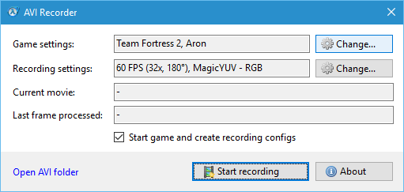
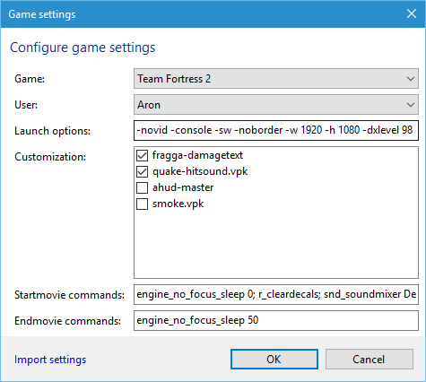
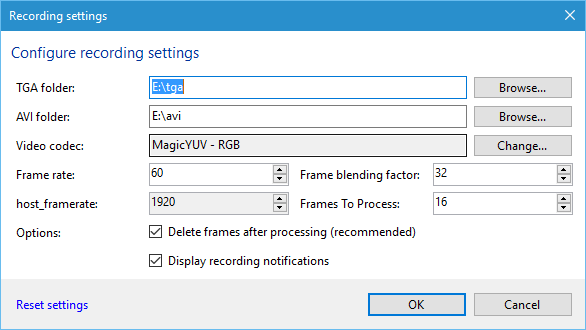
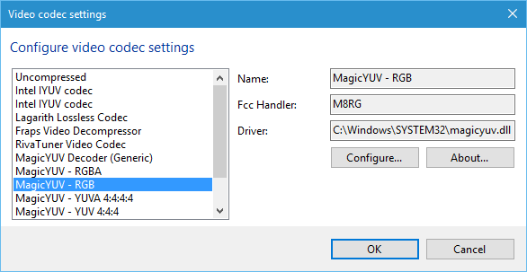

# Purpose
A recording tool that allows you to use the Source Recorder with the ease of Fraps.

# Download
[Latest release](https://github.com/AronParker/AviRecorder/releases) (Requires: [.NET Framework 4.6.2](https://www.microsoft.com/en-us/download/details.aspx?id=53345))

# Features
- Designed to work with all source games and mods (built-in support for TF2 and CSGO)
- Allows individual launch options and customizations for each game
- F9 Start/Stop movie recording
- Faster recording speeds (requires delete frames on process to be enabled (default))
- Built-in frame blending
- Improved gamma handling
- Parallized image processing
- Records OpenDML 2.0 compatible AVI files
- Supports Video for Windows Codecs (VFW)
- Compatible with HLAE/Lawena
- No external dependencies or installations, just one executable

# Performance
This program is designed to perform well and fast. In past recording tools it was common practice to copy files (entire huds and skyboxes) around every time you launch the game. This program avoids this by only moving directories and files between *gameDir*\custom and *gamedir*\custom_store. Moving files and directories is much cheaper than copying, because it basically only modifies the index instead of copying and creating new files.

Secondly it records very efficiently aswell. The program by default deletes tga frames as soon as they are processed. This gives the Windows I/O Subsystem room for caching, essentially if tga frames are deleted soon enough it will never have to write them to disk in the first place. By default Windows uses "Write caching" on disk drives *(you can check this in the Device Manager to verify that it's enabled)*, meaning it has a small room to write files in memory before writing them to disk. If the recorded TGA frames are deleted soon enough, the buffer will never run out essentially giving you the performance of a RAMDisk or a virtual file system.

Additionally frame blending is done in multi-core, meaning it uses all cores on your machine available to process them quickly and in parallel.

# User Interface
## Main Window

**Game settings**: The currently selected game and user.

**Recording**: The currently selected recording settings. They appar in the following format: *FPS* (*%FrameBlendingFactor%*, %ShutterAngle%°), %VideoCompressor%.

**Current movie**: Displays the file name of the current AVI file that is being recorded.

**Last frame processed**: Displays the file name of the last processed TGA frame.

**Start game and create recording configs**: This option writes configs to support F9 start/stop recording. If you use a different recording tool like HLAE or Lawena, you can untick this checkbox so it will only serve as a converter from TGA frames to AVI files.

**Open AVI folder**: Opens the currently set AVI folder.

**Start recording**: Starts the recording process. If "Start game and create recording configs" is checked, it will launch the game and create the configs required to support recording. As soon as a recording is started it will create an avi file and start appending frames to it. Do not open the AVI file while recording takes place. Because there is no way to tell whether a movie recording has ended (Source engine games can't notify the recorder that endmovie is used), there are several triggers to signal that a movie is finished:
* The game closes
* A new movie is started
* Pause/Stop is pressed
Ideally you should just click "Start recording", do all of your recordings and afterwards exit the game.

**About**: Displays the about dialog.

## Game settings

**Game**: The source game or source mod to use for recording.

**User**: The steam user that uses this tool. This is currently only used for importing the correct launch options.

**Launch Options:**: The launch options to start the game with.

**Customization**: The customization files (.vpk files or folders in \custom) to use for the game. When starting the game, it will move all unused items from *gameDir*\custom\ to *gameDir>\custom_store. Likewise it will attempt to move any currently missing custom items from *gameDir*\custom_store\ to *gameDir*\custom\

**Startmovie commands**: The commands to run when starting a recording.

Examples:

| Game                             | Startmovie commands                                                                           |
| -------------------------------- | --------------------------------------------------------------------------------------------- |
| Team Fortress 2                  | engine_no_focus_sleep 0; r_cleardecals; snd_soundmixer Default_Mix; demo_resume; gameui_hide  |
| Counter-Strike: Global Offensive | engine_no_focus_sleep 0; cl_draw_only_deathnotices 1; r_cleardecals; demo_resume; gameui_hide |

**Endmovie commands**: The commands to run when a recording is stopped.

## Recording settings

**TGA folder**: The folder where the game writes TGA files to.

**AVI folder**: The folder where the AVI files will be written to.

**Video codec**: Displays the name of currently used video codec or "Uncompressed" if no codec is selected. Click "Change..." to change the video codec.

**Frame rate**: The frame rate of the AVI file.

**Frame blending factor**: The frame blending factor to use for the AVI file (meaning how many frames are recorded for one AVI frame).

**Frames to process**: Sets how many of the frames that are recorded for one AVI frame are processed. This is used to simulate a shutter angle. For example, if you use a frame blending factor of 32 and set frames to process to 16 you'll achieve a shutter angle of 180°.

### Video codec settings

All the available codecs are listed on the left side. I recommend using [MagicYUV](https://www.magicyuv.com/) for recording for optimal performance.

**Configure...**: Shows the configure dialog of the currently selected codec.

**About...**: Shows the about dialog of the currently selected codec.

# FAQ
**Q**: Can I use this with HLAE or Lawena?

**A**: Yes, just untick "Start game and create recording configs". It will essentially then serve as a converter that when enabled processes all tga frames written to the tga folder and writes the AVI files into the AVI folder.

**Q**: The "Lagarith Lossless codec" gives me an error message
**A**: There is a bug in lagarith where it indicates that it would have a state but actually doesn't. I will fix this in the next release either by not displaying there kinds of error messages or by making an exception for lagarith.

**Q**: The source game / source mod I want to record for does not appear in the games list.

**A**: You need to add the game to the index, which is located in the file "games.kv" (in the same directory as the program). If you successfully add a game, feel free to create a pull request and expand the list of games that are supported by default.

**Q**: I want to report a bug, file an issue or suggest a new feature. How can I do it?

**A**: Use the issue tab above and create a new issue.

# Credits

## Made by
Aron Parker

## Thanks to
Balázs - for making the best lossless codec

Carez - for helping with localization issues

Casual - raising awareness of gamma errors

CroftCreations - for helping out with CS:GO support

Mark James - famfamfam silk icons
